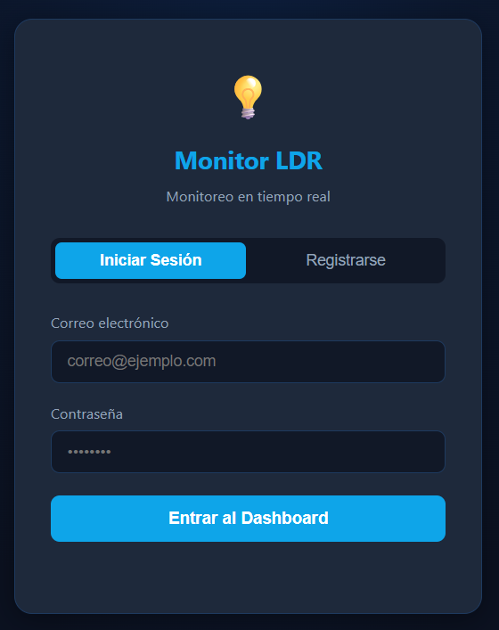
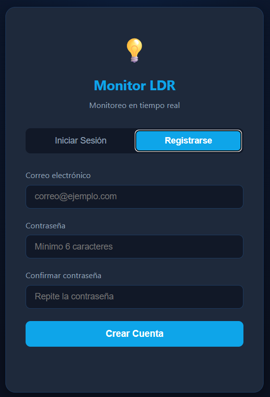
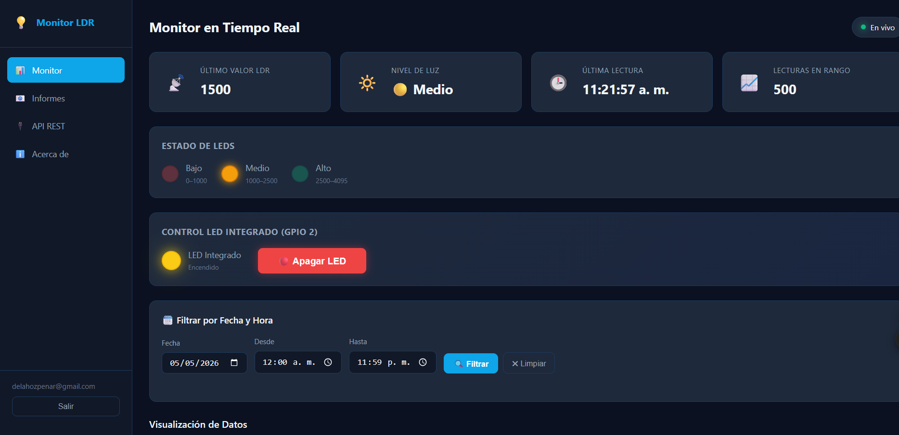
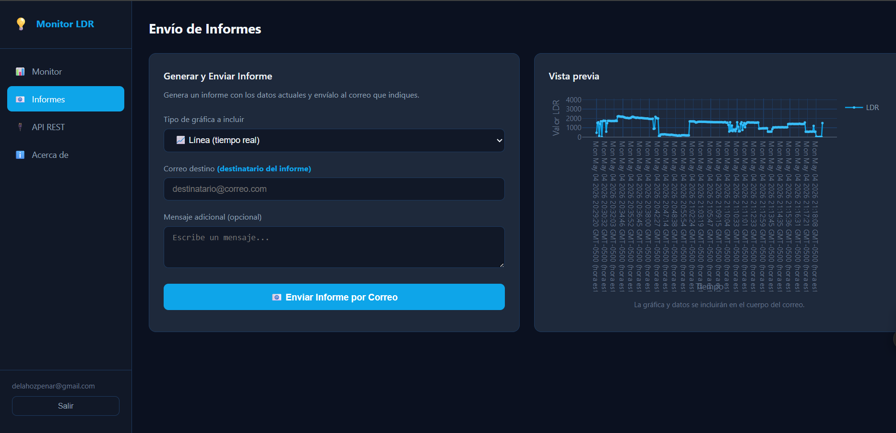
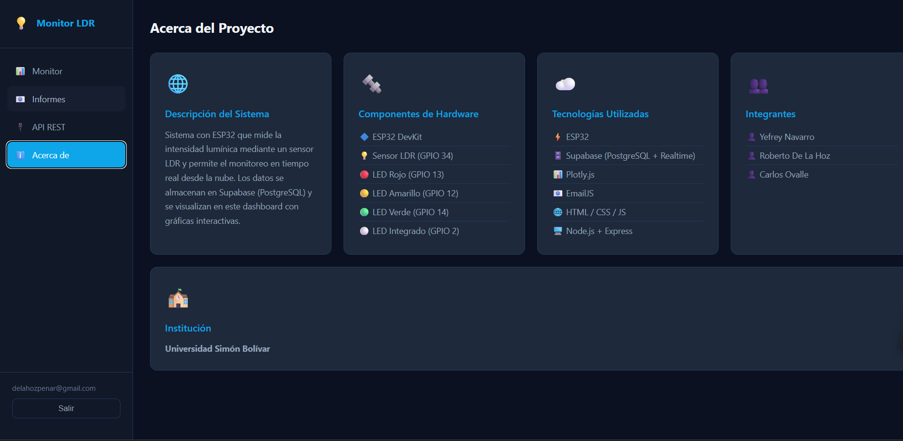

Monitor LDR IoT — Universidad Simón Bolívar

Proyecto: Sistema de monitoreo de luminosidad con ESP32  
Integrantes: Yefrey Navarro - Roberto De La Hoz - Carlos Ovalle  
Institución: Universidad Simón Bolívar — Barranquilla, Colombia

Tabla de Contenidos
1. Descripción general
2. Arquitectura General
3. Hardware
4. Tecnologías
5. Instalación y ejecución loca
6. Despliegue en Render.com
7. Estructura del Proyecto
8. Autenticación
9. Variables de configuración
10. API REST
11. Autenticación y seguridad
12. Sensor LDR
13. Control LED Integrado (GPIO 2)
14. Base de Datos (Supabase)
15. Funcionalidades del dashboard
16. Dependencias (package.json)


1. Descripción General
Sistema IoT que permite monitorear en tiempo real la intensidad lumínica medida por un sensor LDR conectado a un microcontrolador ESP32. Los datos se almacenan en una base de datos en la nube (Supabase / PostgreSQL) y se visualizan a través de un dashboard web con gráficas interactivas Plotly.js. El sistema también permite controlar un LED integrado del ESP32 de forma remota desde el navegador.


2. Arquitectura general
┌─────────────┐        Wi-Fi / HTTP        ┌──────────────────┐
│   ESP32     │ ─────────────────────────► │  Supabase REST   │
│  + LDR      │                            │  (PostgreSQL)    │
│  + LEDs     │ ◄──────────────────────── │  + Realtime WS   │
└─────────────┘    polling led_control     └────────┬─────────┘
                                                    │ REST API
                                                    ▼
                                         ┌──────────────────────┐
                                         │  Node.js + Express   │
                                         │  (Render.com)        │
                                         │  • Sirve el frontend │
                                         │  • API REST /sensor  │
                                         │  • Auth con bcrypt   │
                                         │  • Control LED       │
                                         └──────────┬───────────┘
                                                    │ HTTP
                                                    ▼
                                         ┌──────────────────────┐
                                         │  Dashboard Web       │
                                         │  (Browser)           │
                                         │  HTML + CSS + JS     │
                                         │  Plotly.js + EmailJS │
                                         └──────────────────────┘

3. Hardware
 Componentes
| Componente | Pin GPIO |
|------------|----------|
| Sensor LDR | GPIO 34 (ADC) |
| LED Rojo (nivel bajo) | GPIO 13 |
| LED Amarillo (nivel medio) | GPIO 12 |
| LED Verde (nivel alto) | GPIO 14 |
| LED Integrado (controlable remotamente) | GPIO 2 |

Niveles de luz (rango ADC 0–4095)
| Nivel | Rango | Indicador |
|-------|-------|-----------|
| Bajo 🔴 | 0 – 999 | LED Rojo activo |
| Medio 🟡 | 1000 – 2499 | LED Amarillo activo |
| Alto 🟢 | 2500 – 4095 | LED Verde activo |

4. Tecnologías Utilizadas
| Capa | Tecnología |
|------|------------|
| Microcontrolador | ESP32 DevKit |
| Base de datos | Supabase (PostgreSQL + Realtime) |
| Backend | Node.js + Express |
| Frontend | HTML5 / CSS3 / JavaScript |
| Gráficas | Plotly.js v2.27 |
| Envío de informes | EmailJS |
| Seguridad (hash) | bcrypt (SALT_ROUNDS = 12) |

5. Instalación y ejecución local
Requisitos previos
- Node.js v18 o superior
- Cuenta en [Supabase](https://supabase.com) con las tablas configuradas ver sección Base de datos (Supabase)
 
 Pasos
 1. Clonar el repositorio
git clone https://github.com/tu-usuario/monitor-ldr.git
cd monitor-ldr

 2. Instalar dependencias
npm install

 3. Iniciar el servidor
node server.js

El servidor quedará disponible en http://localhost:3000.

6. Despliegue en Render.com
El servidor está desplegado como un **Web Service** en [Render.com](https://render.com). Express sirve tanto la API REST como los archivos estáticos del frontend (`index.html`, `styles.css`, `app.js`) desde la misma URL.

Pasos para desplegar
1. Crear una cuenta en [render.com](https://render.com) y conectar el repositorio de GitHub.

2. Crear un nuevo **Web Service** con la siguiente configuración:
| Campo | Valor |
|---|---|
| Runtime | Node |
| Build Command | `npm install` |
| Start Command | `node server.js` |
| Plan | Free (o superior) |

3. Una vez desplegado, Render asigna una URL pública del tipo:
   https://monitor-ldr.onrender.com

**Terminal ejecutando el servidor: Captura de la consola mostrando el mensaje de inicio con todos los endpoints listados**


7. Estructura del proyecto
monitor-ldr/
├── server.js        # Servidor Express + endpoints REST
├── index.html       # Interfaz web (login + dashboard)
├── styles.css       # Estilos del dashboard
├── app.js           # Lógica frontend (Plotly, fetch, auth)
└── package.json     # Dependencias del proyecto

8. Autenticación
El sistema cuenta con pantallas de login y registro protegidas. Las contraseñas se hashean con bcrypt antes de guardarse en la base de datos.

**Pantalla de Login: Captura del formulario de inicio de sesión con las pestañas "Iniciar Sesión" / "Registrarse" visibles.**


Flujo de Login
1. El cliente envía `{ email, password }` a `POST /auth/register`.
2. El servidor verifica que el correo no esté duplicado en Supabase.
3. Se genera el hash con `bcrypt.hash(password, 12)` (12 rondas de sal).
4. Solo el hash se almacena en la base de datos. La contraseña en texto plano nunca se persiste.

**Pantalla de Registro: Captura con los tres campos (correo, contraseña, confirmar contraseña).**


Flujo de Registro
1. El cliente envía `{ email, password }` a `POST /auth/login`.
2. El servidor recupera el usuario por email desde Supabase.
3. Se compara la contraseña con el hash usando `bcrypt.compare()`.
4. Si coincide, se devuelve `{ id, email }`. El hash nunca se envía al cliente.

9. Variables de configuración
Las credenciales están definidas directamente en el código. Para producción se recomienda moverlas a variables de entorno de Render (sección **Environment** en el panel del Web Service).

- En server.js
```js
const SUPABASE_URL = process.env.SUPABASE_URL || 'https://<tu-proyecto>.supabase.co';
const SUPABASE_KEY = process.env.SUPABASE_KEY || '<tu-anon-key>';
```

- En app.js (frontend)
```js
const SUPABASE_URL     = 'https://<tu-proyecto>.supabase.co';
const SUPABASE_KEY     = '<tu-anon-key>';       // Solo para Realtime WS y lecturas
const EMAILJS_SERVICE  = '<tu-service-id>';
const EMAILJS_TEMPLATE = '<tu-template-id>';
const EMAILJS_PUBLIC   = '<tu-public-key>';
```

**Importante**: La clave `SUPABASE_KEY` del frontend debe ser la clave pública `anon`. Nunca exponer la `service_role` key en el cliente.

10. API REST
Base URL local: http://localhost:3000
Base URL producción: https://monitor-ldr.onrender.com

Documentación de la API
| Método | Endpoint | Descripción |
|--------|----------|-------------|
| GET | `/api` | Lista todos los endpoints disponibles |

**GET /api documentación: Abrir http://localhost:3000/api. Captura mostrando el JSON con todos los endpoints documentados.**


11. Autenticación y Seguridad
| Método | Endpoint | Descripción | Body |
|--------|----------|-------------|------|
| POST | `/auth/register` | Registrar nuevo usuario (contraseña hasheada con bcrypt) | `{ "email": "...", "password": "..." }` |
| POST | `/auth/login` | Iniciar sesión, verifica hash bcrypt | `{ "email": "...", "password": "..." }` |

- El servidor verifica el hash en cada inicio de sesión con bcrypt.compare().
- Los correos se verifican como únicos antes de registrar un nuevo usuario.
- El sistema maneja la autenticación mediante rutas propias en Express, no directamente contra Supabase desde el frontend. Esto evita exponer contraseñas en texto plano en las URLs de las peticiones.

12. Sensor LDR
| Método | Endpoint | Descripción |
|--------|----------|-------------|
| GET | `/sensor` | Últimas 100 lecturas del sensor |
| GET | `/sensor/:valor` | Lecturas filtradas por valor exacto (ej: `/sensor/0`) |
| POST | `/sensor` | Insertar lectura manual |

**GET /sensor respuesta JSON: Abrir http://localhost:3000/sensor directamente en el navegador. Captura del JSON de respuesta con datos reales del sensor.**


**POST /sensor Postman o Hoppscotch: Configurar un POST a http://localhost:3000/sensor con body { "valor_ldr": 1500 }. Captura de la respuesta `Lectura insertada correctamente`. Esto demuestra el PUSH de datos.**


13. Control LED Integrado (GPIO 2)
| Método | Endpoint | Descripción |
|--------|----------|-------------|
| GET | `/led` | Consulta estado actual del LED |
| GET | `/led/1/on` | Enciende el LED integrado (GPIO 2 HIGH) |
| GET | `/led/0/off` | Apaga el LED integrado (GPIO 2 LOW) |

Ejemplo de respuesta — GET /led/1/on:
{
  "ok": true,
  "estado": true,
  "descripcion": "💡 LED integrado ENCENDIDO — ESP32 GPIO 2 HIGH"
}

**GET /led/1/on respuesta + LED encendido: Abrir http://localhost:3000/led/1/on en el navegador. Captura del JSON de respuesta.**


14. Base de Datos (Supabase)
Tabla usuarios:
| Columna | Tipo | Descripción |
|---------|------|-------------|
| `id` | integer (PK) | ID autoincremental |
| `email` | text (unique) | Correo del usuario |
| `password` | text | Contraseña hasheada con bcrypt |

```sql
CREATE TABLE usuarios (
  id       BIGINT GENERATED ALWAYS AS IDENTITY PRIMARY KEY,
  email    TEXT UNIQUE NOT NULL,
  password TEXT NOT NULL   -- almacena el hash bcrypt, nunca texto plano
);
```
**Tabla Usuarios: Captura de la tabla usuarios mostrando que el campo password contiene el hash bcrypt (empieza con `$2b$12$...`), no la contraseña en texto plano.**


Tabla sensores:
| Columna | Tipo | Descripción |
|---------|------|-------------|
| `id` | integer (PK) | ID autoincremental |
| `valor_ldr` | integer | Valor ADC del sensor (0–4095) |
| `created_at` | timestamp | Fecha y hora de la lectura |

```sql
CREATE TABLE sensores (
  id         BIGINT GENERATED ALWAYS AS IDENTITY PRIMARY KEY,
  valor_ldr  INTEGER NOT NULL CHECK (valor_ldr >= 0 AND valor_ldr <= 4095),
  created_at TIMESTAMPTZ DEFAULT NOW()
);
```
**Tabla sensores en Supabase: Captura mostrando filas con datos reales (id, valor_ldr, created_at).**


Tabla led_control:
| Columna | Tipo | Descripción |
|---------|------|-------------|
| `id` | integer (PK) | Siempre = 1 (registro único) |
| `estado` | boolean | `true` = encendido, `false` = apagado |

```sql
CREATE TABLE led_control (
  id     INTEGER PRIMARY KEY DEFAULT 1,
  estado BOOLEAN DEFAULT FALSE
);

-- Insertar el único registro de control
INSERT INTO led_control (id, estado) VALUES (1, false);
```

15. Funcionalidades del dashboard

1) Monitor — Vista principal
**Dashboard Monitor: Captura de la sección Monitor con las 4 tarjetas de estado visibles (último valor LDR, nivel de luz, hora y total de lecturas) y los indicadores de LED activos.**


- Muestra el último valor LDR, nivel de luz, hora de última lectura y total de lecturas en el rango activo.
- LEDs visuales en pantalla que reflejan el nivel actual (bajo / medio / alto).
- Gráficas interactivas con Plotly.js: línea temporal, niveles por categoría, promedio por hora e histograma de distribución.
- Filtro por fecha y rango horario (hasta 1000 lecturas por consulta filtrada).
- Actualización automática vía Supabase Realtime (WebSocket) sin necesidad de recargar la página.

**Gráfica Línea: Con el selector en "Línea (tiempo real)" y varias lecturas visibles en la gráfica Plotly.**


**Grafica alternativa: Cambiar el selector a "Niveles" o "Histograma de distribución". Captura de esa vista.**


**Control LED: Captura del panel con el botón mostrando estado "Encendido" y el indicador visual cambiado.**


- Botón para encender/apagar el LED integrado del ESP32 (GPIO 2) de forma remota.
- El estado se sincroniza mediante polling cada 1 segundo.

**Filtro fecha: Seleccionar una fecha y rango de horas, hacer clic en "🔍 Filtrar". Captura mostrando el mensaje de resultados filtrados y la gráfica actualizada.**


2) Informes
**Informes: Captura del formulario con el campo de correo destino, mensaje, y la vista previa de la gráfica visible a la derecha.**


- Selección del tipo de gráfica a incluir en el informe.
- Envío del informe al correo indicado con estadísticas (mínimo, máximo, promedio, conteos por nivel) e imagen de la gráfica, usando EmailJS.

API REST (sección del dashboard)
**API REST - Dashboard: Hacer clic en "▶ Probar" del endpoint GET /sensor. Captura mostrando la respuesta JSON en el panel inferior del dashboard.**


3) About
**Sección Acerca de: Captura de la sección completa con las tarjetas de descripción, hardware, tecnologías e integrantes.**   


16. Dependencias (package.json)

{
  "bcrypt": "^5.1.1",
  "cors": "^2.8.5",
  "express": "^4.18.2",
  "node-fetch": "^3.3.2"
}
